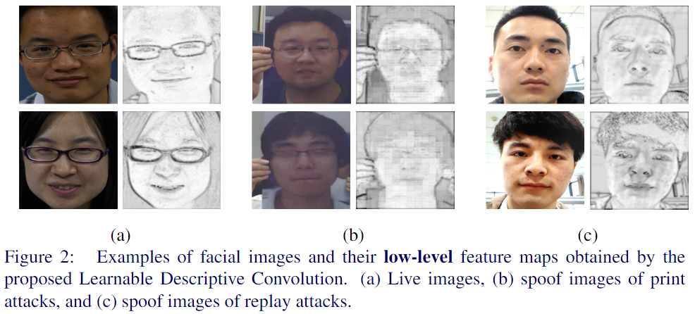

# LDCNet
### Learnable Descriptive Convolutional Network for Face Anti-Spoofing (BMVC'22)

To install the requirements use:
`pip3 install -r requirements.txt`

Step 1: execute `Amap_train.py` to get pretrained model for producing activation map 

Step 2: execute `train.py` to train LDCNet

Step 3: execute `test.py`
