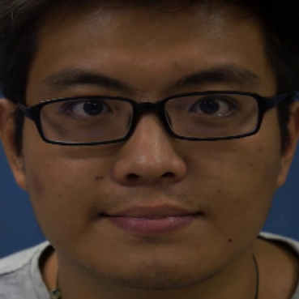

# LDCNet
### Learnable Descriptive Convolutional Network for Face Anti-Spoofing (BMVC'22)

## Feature maps extracted by LDC 

Generate by `Low_level_features_visualization.py` 

## Learnable Descriptive Convolution


## Network Architecture


## Requirements
```
grad_cam==1.3.5
matplotlib==3.5.2
numpy==1.22.3
scikit_learn==1.1.2
torch==1.12.0
torchvision==0.13.0
```

## Training
Step 1: run `Amap_train.py` to get pretrained model for producing activation map 

Step 2: run `train.py` to train LDCNet

## Testing
run `test.py`

## More visualization: Feature maps extracted by LDC
### Live images:




### Print images (grid artifacts):


### Replay images (moiré patterns):


## Citation

If you use the LDC, please cite the paper:

```
@article{huang2022learnable,
  title={Learnable Descriptive Convolutional Network for Face Anti-Spoofing},
  author={Huang, Pei-Kai and Ni, Hui-Yu and Ni, Yan-Qin and Hsu, Chiou-Ting},
  year={2022}
}
```
